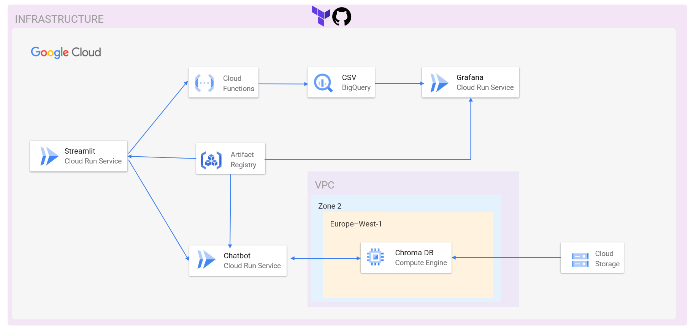

# AI Green Metrics - TFM NTT DATA

Proyecto desarrollado como Trabajo de Fin de Máster (Máster en Big Data & Cloud + Máster en Inteligencia Artificial, curso 2024-2025) en colaboración con NTT DATA.

## Descripción

El proyecto aborda el reto **AI GreenMetrics** propuesto por NTT DATA, con el objetivo de construir soluciones sostenibles aplicadas a modelos de inteligencia artificial. Se divide en dos subproyectos independientes:

1. **Chatbot comparador de modelos de IA**  
   Asistente conversacional desarrollado en Streamlit y desplegado en Cloud Run, capaz de recomendar modelos de IA (ChatGPT, Gemini, etc.) según el caso de uso y optimizar su infraestructura.

2. **Análisis energético de modelos IA**  
   Pipeline de limpieza de datasets energéticos en Python, con cálculo de métricas (CO₂, energía, precisión) e integración con BigQuery + Grafana para visualización en dashboards.

## Arquitectura

Todo el sistema está desplegado en Google Cloud Platform:

- Cloud Run (frontend Streamlit + backend del chatbot + Grafana)
- ChromaDB en Compute Engine (base vectorial para embeddings)
- BigQuery (almacenamiento analítico de métricas)
- Firestore (persistencia de conversaciones)
- Cloud Functions (limpieza de datos)
- Terraform + GitHub Actions (infraestructura como código + CI/CD)



## Tecnologías usadas

- Python
- Streamlit
- Gemini API
- ChromaDB
- Docker
- Terraform
- BigQuery
- Grafana
- Firestore
- GitHub Actions

## Cómo usar

1. Clona el repositorio:
   ```
   git clone https://github.com/AngelitoMA11/TFM_NTTData.git
   ```
2. Edita los archivos de Terraform para configurar tu proyecto GCP.
3. Lanza los despliegues con:
   ```
   terraform init
   terraform apply
   ```
4. Accede a la interfaz principal desplegada en Cloud Run para:
   - Interactuar con el chatbot
   - Subir un CSV energético y visualizar métricas

## Métricas calculadas

- EPT (Energy per Training)
- CPT (CO₂ Emissions per Training)
- EPP (Energy per Prediction)
- CE (Carbon Efficiency)
- DWR (Data Waste Ratio)
- MFS (Model Footprint Score)

## Equipo

- Lara Rubio Escandell  
- Ángel Martínez Albert  
- Gonzalo López Blanquer  
- Eduardo Abad Zapata  

Colaboración con NTT DATA  
